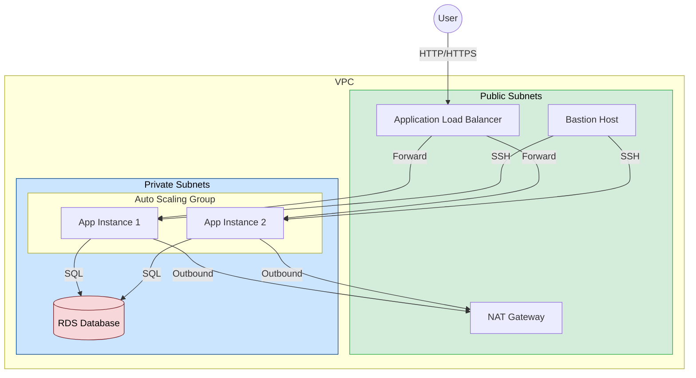

# Infrastructure Architecture

This diagram represents the AWS infrastructure defined in the Terraform configuration.

```mermaid
graph TD
    subgraph VPC [VPC]
        direction TB
        
        subgraph Public_Subnets [Public Subnets]
            ALB[Application Load Balancer]
            Bastion[Bastion Host]
            NAT[NAT Gateway]
        end
        
        subgraph Private_Subnets [Private Subnets]
            subgraph ASG [Auto Scaling Group]
                App1[App Instance 1]
                App2[App Instance 2]
            end
            RDS[(RDS Database)]
        end
    end

    User((User)) -->|HTTP/HTTPS| ALB
    ALB -->|Forward| App1
    ALB -->|Forward| App2
    
    Bastion -->|SSH| App1
    Bastion -->|SSH| App2
    
    App1 -->|SQL| RDS
    App2 -->|SQL| RDS
    
    App1 -->|Outbound| NAT
    App2 -->|Outbound| NAT
    
    classDef public fill:#d4edda,stroke:#28a745,color:black
    classDef private fill:#cce5ff,stroke:#004085,color:black
    classDef db fill:#f8d7da,stroke:#721c24,color:black
    
    class Public_Subnets public
    class Private_Subnets private
    class RDS db
```
